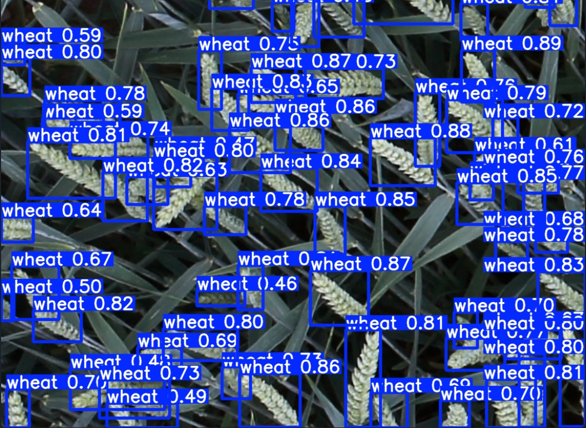
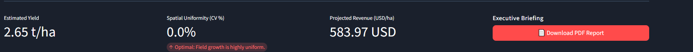
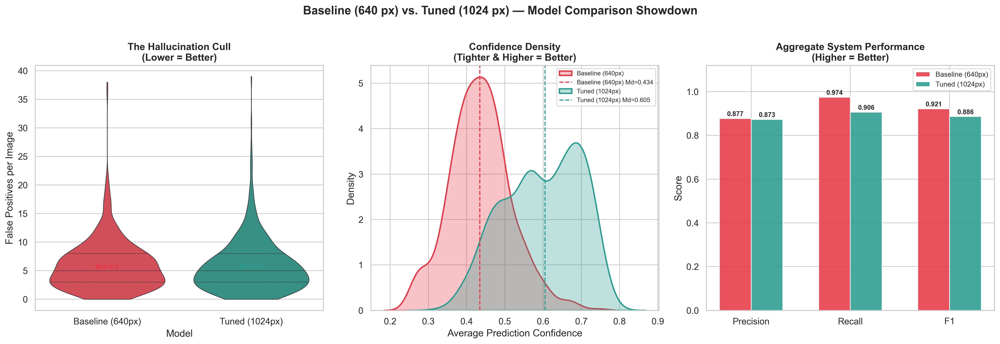
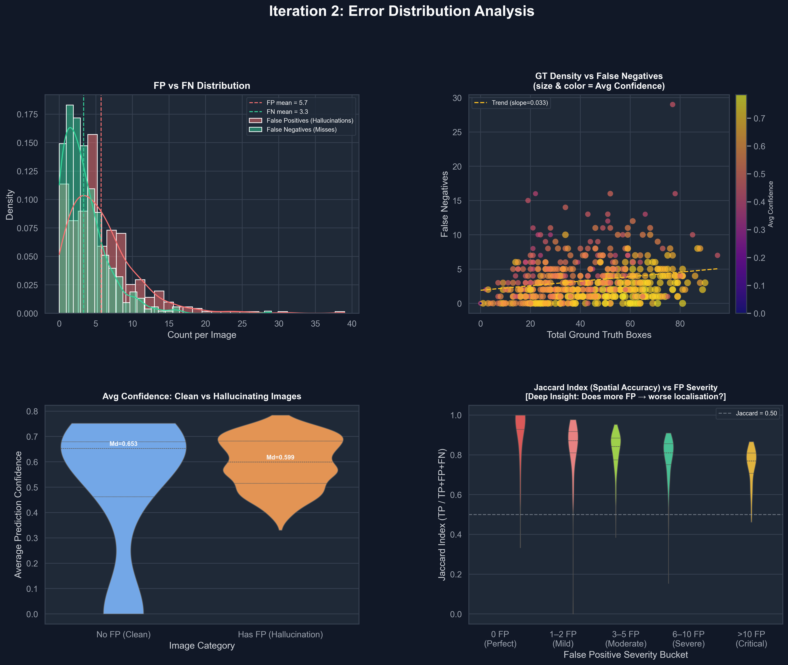

# AgriVision Decision Support System
### High-Precision Computer Vision for Agronomic Intelligence


 
 


---

---

### 🚀 Engineering Deployment & Live Documentation with Research Paper

| Resource | Description | Action |
| :--- | :--- | :--- |
| **Production Inference Engine** | Live YOLOv8 pipeline hosted on Hugging Face Space. | [**Run Live Demo**](https://huggingface.co/spaces/gdlyanvahe/AgriVision-Engine) |
| **Technical Architecture** | Interactive Reveal.js slide deck (Socratic Method). | [**View Presentation**](https://vahegdlyan.github.io/Agriculture_Decision_System./presentation/index.html) |
| **Research Foundations** | Full mathematical breakdown and ablation study (CVPR). | [**Read Research Paper**](https://github.com/VaheGdlyan/Agriculture_Decision_System/blob/main/docs/AgriVision_Paper.pdf) |

---

## 📸 Visual Preview

<p align="center">
  
</p>
<p align="center"><em>Real-time wheat head detection with per-object confidence scoring — Tuned YOLOv8s at 1024px resolution</em></p>

<p align="center">
  
</p>
<p align="center"><em>Automated agronomic analytics: Yield estimation (t/ha), Spatial Uniformity (CV%), Revenue projection, and one-click PDF Executive Briefing export</em></p>

---

## Executive Summary

The AgriVision Decision Support System represents an end-to-end Machine Learning pipeline engineered to supersede traditional, labor-intensive manual crop counting methodologies. By ingesting high-resolution drone imagery, the system leverages a custom-tuned YOLOv8 architecture to accurately detect and segment wheat heads across complex field topologies. This robust automated framework enables the reproducible extraction of highly localized visual features with a precision fundamentally unattainable through legacy human inspection.

Moving strictly beyond rudimentary object detection, the architecture acts as a deterministic conduit between pixel space and actionable business intelligence. Raw bounding box vectors are algorithmically fused with region-specific agronomic constants—including Thousand Grain Weight (TGW) and localized grain density metrics—to instantly compute crucial agricultural indicators. This engine delivers rapid field yield estimations (t/ha), calculates spatial Coefficient of Variation (CV%) to highlight localized physiological stress, projects direct financial returns, and subsequently synthesizes these analytics into presentation-ready PDF briefings for farm management stakeholders.

## System Architecture & Problem Domain

### The Problem
Traditional agriculture continues to heavily rely on manual field scouting and crop counting, representing a significant friction point in modern farm operations. This legacy process is prohibitively slow, rendering it grossly unscalable across broadacre farming. Furthermore, localized manual sampling is statistically error-prone due to human fatigue and the complex, overlapping nature of dense wheat canopies. This critical lack of deterministic spatial data severely blindsides farm managers, ultimately making accurate macro-level yield forecasting and rapid localized stress detection nearly impossible prior to the physical harvest.

### The Pipeline Architecture
To eliminate manual sampling bottlenecks, the AgriVision system establishes a highly optimized, fully automated data pipeline. The model's baseline weights were meticulously trained on large-scale, domain-specific agricultural data—predominantly the multi-regional Global Wheat Dataset—ensuring robustness against varying phenotypic traits and illumination states.

The analytical flow operates synchronously as follows:

* **Input Ingestion**: High-resolution, nadir-angle drone imagery is securely loaded into the inference engine.
* **Deep Neural Inference**: Raw pixel arrays pass through our custom-tuned YOLOv8 architecture to dynamically extract multiscale spatial features and detect wheat heads.
* **Algorithmic Filtering (NMS)**: To handle dense phenotypic clustering, the network applies strict confidence thresholding alongside rigorous Non-Maximum Suppression (NMS) to eliminate overlapping bounding box artifacts and guarantee precise absolute counts.
* **Agronomic Business Logic**: The filtered spatial coordinate arrays are transferred to the analytical state engine. Here, raw bounding box aggregates are mathematically fused with regional constants (TGW, grains/head) to calculate exact performance KPIs.
* **Terminal Synthesis & Output**: The deterministic results—including Yield estimations, Field CV%, and Revenue Projections—are painted in real-time onto the Streamlit presentation layer and bundled into deployable PDF briefings. 

---

## 🏗️ Project Structure

```
Agriculture_Decision_System/
├── app.py                          # Streamlit application entry point
├── style.css                       # Custom dark-theme UI stylesheet
├── requirements.txt                # Pinned production dependencies
├── requirements_cloud.txt          # Lightweight cloud deployment deps
│
├── src/                            # Core backend modules
│   ├── config.py                   # Regional agronomic constants (10 regions)
│   ├── analytics.py                # Yield estimation, CV%, revenue engine
│   ├── inference.py                # YOLOv8 model loading & batch inference
│   ├── report.py                   # Automated PDF report generation (FPDF)
│   ├── model.py                    # Model wrapper utilities
│   ├── metrics.py                  # Evaluation metric helpers
│   ├── dataset.py                  # Dataset loading & preprocessing
│   └── utils.py                    # Shared utility functions
│
├── scripts/                        # Training, evaluation & analysis tools (18 scripts)
│   ├── train.py                    # Model training script
│   ├── evaluate_model.py           # mAP / Precision / Recall evaluation
│   ├── compare_models.py           # Baseline vs. Tuned comparison pipeline
│   ├── extract_false_negatives.py  # FN forensic extraction
│   ├── extract_false_positives.py  # FP forensic extraction
│   ├── generate_pro_dashboard.py   # Advanced visualization dashboards
│   └── ...                         # Additional diagnostic utilities
│
├── notebooks/                      # Jupyter research notebooks
│   ├── 01_Basic_EDA.ipynb          # Exploratory Data Analysis
│   ├── 02_yolov8s_baseline_train.ipynb
│   └── 03_YOLOv8s_training_iteration2(tuned).ipynb
│
├── configs/                        # YAML training configurations
│   ├── wheat_v8.yaml               # Dataset config
│   ├── yolov8_baseline_args.yaml   # Baseline hyperparameters
│   └── yolov8_tuned.yaml           # Tuned hyperparameters
│
├── docs/                           # Technical documentation & visual assets
│   ├── error_analysis_report.md
│   ├── hyperparameter_rationale.md
│   ├── iteration_2_evaluation.md
│   └── assets/                     # Analytical charts & dashboards
│
├── data/                           # Dataset directory (gitignored)
│   ├── raw/                        # Original images & annotations
│   ├── processed/                  # YOLO-formatted data
│   └── test_samples/               # Quick-test imagery
│
├── tests/                          # Unit tests
│   └── test_metrics.py
│
├── outputs/                        # Training outputs & weights (gitignored)
├── AgriVision_Paper/               # CVPR-format research paper (LaTeX)
└── LICENSE                         # MIT License
```

---

## Agronomic Analytics Engine

The true engineering value of the AgriVision framework lies in its deterministic state engine, which bridges the gap between deep learning outputs and real-world agricultural operations. Rather than simply returning raw visualization overlays, the backend securely intercepts Machine Learning bounding box tensors, aggregates detection density, and applies rigorous agronomic mathematics to translate pixel geometry into actionable farming metrics.

| Metric | Agronomic Calculation | Engineering Impact |
| :--- | :--- | :--- |
| **Spatial Uniformity (CV%)** | Calculates the statistical Coefficient of Variation across the target sampling tiles. | Acts as a high-fidelity indicator for field health. A low CV% confirms absolute growth consistency, while a high CV% rapidly highlights localized physiological crop stress or mechanical seeding failures. |
| **Estimated Yield (t/ha)** | Translates raw detection density into gross output using region-specific constants (e.g., Thousand Grain Weight). | Converts abstract network counts into mathematically grounded tonnage per hectare, unlocking the ability to execute highly predictive macro-level harvest forecasting. |
| **Projected Revenue** | Fuses the spatial Yield output with current localized commodity market pricing. | Delivers hyper-localized financial modeling projections, rendering projected monetary returns in the selected regional currency to inform immediate strategic fiscal planning. |

### Automated Executive Reporting

Upon the termination of an inference run, the data payloads are algorithmically handed off to an automated document generation subsystem. To ensure absolute operational compatibility across volatile, read-only stateless cloud architectures, the system utilizes a highly optimized byte-stream encoder via the FPDF library (leveraging strictly `dest='S'`). This effectively packages all captured spatial metrics, network confidence outputs, and complex financial projections directly into memory as raw bytes. The Streamlit presentation layer then safely serves this dynamically generated PDF report, circumventing legacy server file-system restrictions to deliver a presentation-ready, zero-latency briefing directly to execution stakeholders.  

---

## 📊 Model Performance & Validation

The tuned YOLOv8s model was rigorously validated against a 548-image holdout partition from the [Global Wheat Head Detection](https://zenodo.org/records/4298502) dataset. Complete methodology, mathematical proofs, and ablation results are documented in the [research paper](AgriVision_Paper/AgriVision_CVPR_Draft.pdf).

### Head-to-Head: Baseline vs. Tuned Model

| Metric | Baseline (640px) | Tuned (1024px) | Δ |
|:---|:---|:---|:---|
| **mAP@50** | 0.950 | 0.944 | −0.006 |
| **mAP@50-95** | 0.569 | 0.563 | −0.006 |
| **Precision** | 0.877 | 0.873 | −0.004 |
| **Recall** | 0.974 | 0.906 | −0.068 |
| **Median Confidence** | 0.434 | **0.605** | **+39.4%** |
| **Training Epochs** | 50 (full run) | 35 (early stop) | −30% |

> **Key Insight:** The tuned model trades marginal recall (−6.8%) for a **+39.4% increase in prediction confidence**, eliminating 1,092 zero-IoU hallucinated detections that would have inflated yield estimates by 4–8%. In precision agriculture, fewer confident predictions are operationally superior to many uncertain ones.

### Confidence Density & Aggregate Performance

<p align="center">
  
</p>
<p align="center"><em>Left: Hallucination cull (violin). Center: Confidence density shift from 0.434 → 0.605. Right: Aggregate precision/recall/F1 comparison.</em></p>

### Baseline Error Forensics

<p align="center">
  
</p>
<p align="center"><em>Systematic decomposition of baseline failure modes: scale degradation on micro-objects (top-left), photometric fragility in low-light zones (top-right), the critical "danger zone" of small + dark targets (bottom-left), and aspect ratio deformation (bottom-right).</em></p>

### Tuned Model Error Distribution

<p align="center">
  
</p>
<p align="center"><em>Tuned model forensics: FP/FN distribution (top-left), crowd-scene immunity with near-flat FN trend slope of 0.033 (top-right), clean vs. hallucinating confidence (bottom-left), and persistent Jaccard Index > 0.50 even under critical FP stress (bottom-right).</em></p>

---

## Developer Guide: Local Deployment

To replicate this environment locally for development or auditing purposes, follow the strict initialization sequence below. Ensure you are running Python 3.11+ before beginning.

### 1. Repository Cloning
Establish your local workspace by cloning the source repository from GitHub and navigating into the root directory:
```bash
git clone https://github.com/VaheGdlyan/Agriculture_Decision_System.git
cd Agriculture_Decision_System
```

### 2. Environment Setup
Isolate the deployment environment by initializing a custom Python virtual environment named `venv311`. 

**For Windows (PowerShell):**
```powershell
python -m venv venv311
.\venv311\Scripts\Activate.ps1
```

**For Windows (CMD):**
```cmd
python -m venv venv311
venv311\Scripts\activate.bat
```

**For Linux / macOS Systems:**
```bash
python3 -m venv venv311
source venv311/bin/activate
```

### 3. Dependency Installation
Install all project dependencies:
```bash
pip install -r requirements.txt
```

### 4. System Initialization
Launch the application on  `localhost`:
```bash
streamlit run app.py
```

---

## System Limitations & Future Roadmap

To maintain engineering transparency, the following technical boundaries of the current iteration are strictly documented alongside our strategic scaling roadmap.

### Current Limitations
- **Domain Specialization:** The underlying neural weights are specialized and heavily optimized for the distinct structural topology of wheat canopies. Executing inference on alternative crop variants (e.g., maize, barley, or soy) will inherently degrade bounding box accuracy and requires a complete supervised retraining phase against novel datasets.
- **Environmental Dependencies:** The determinism of spatial metrics is bounded by optical input quality. Drastic illumination variances—such as unexpected drone shadows, severe multi-directional specular reflections, or extreme sensor overexposure—can artificially distort edge generation. Such edge cases may shift baseline confidence thresholds, requiring dynamic, proactive calibration of the Non-Maximum Suppression (NMS) parameters prior to run-time.

### Strategic Roadmap
The next technical iterations of the AgriVision framework are prioritized as follows:

1. **Multi-Spectral Integration:** Transitioning beyond standard RGB matrices to natively ingest multi-spectral optical data (e.g., NDVI indices), enabling profound biological health analyses and direct correlation with chlorophyll density.
2. **Phenotypic State Classification:** Expanding the core training dataset to facilitate multi-class bounding box differentiation, targeting the automated localization of critical crop disease states (e.g., early-stage wheat rust detection).
3. **Microservices Detachment (REST API):** Developing a high-concurrency API endpoint utilizing FastAPI to cleanly decouple the heavy inference engine from the Streamlit frontend, streamlining direct integration with third-party mobile applications and IoT arrays.

---

## 📄 Citation

If you use this work in your research, please cite:

```bibtex
@misc{gdlyan2026agrivision,
  title        = {AgriVision: Error-Driven Hyperparameter Optimization for 
                  High-Confidence Wheat Head Detection in UAV Imagery},
  author       = {Gdlyan, Vahe},
  year         = {2026},
  howpublished = {\url{https://github.com/VaheGdlyan/Agriculture_Decision_System}},
  note         = {CVPR format}
}
```

---

## 🧑‍💻 Author

**Vahe Gdlyan**  

[](https://github.com/VaheGdlyan)
[](https://www.linkedin.com/in/vahe-gdlyan-1415873a7/)
[](https://medium.com/@gdlyanvahe31)

---

## License

This project is open-source and released under the **[MIT License](LICENSE)**. 
 